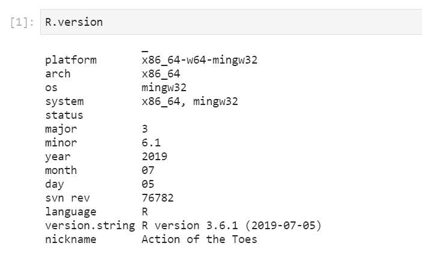

# ML-Project : Project in machine learning : predicting the smell of a given molecule in the context of a kaggle competition
> Introduction of the project:  
> In this project, we were given access to a database of responses from a subject who had been asked to rate the pleasantness of the smell of a large number of molecules; and a comprehensive list of the physical and chemical features of the molecules smelled. The ultimate goal of our algorithm is to predict the correspondence between the pleasantness of each smell and a given molecule. The data set and the task are derived from the paper : https://science.sciencemag.org/content/355/6327/820. You can find the complete project, documentation and dataset on our GitHub page: https://github.com/CamilleDelgrange/ML-Project 

# Team Members
* Salomé Baup; Camille Delgrange  
https://github.com/salome-baup  
https://github.com/CamilleDelgrange

# How to reproduce the code ?
> You can find 2 files for the project, one "Project_Linear_Methods.ipynb" where we put exploration of the data and the linear methods and a "Project_Non_Linear_Methods.ipynb" containing the part with non-linear methods. You can execute them separately and get full reproducibility thanks to fixed seeds.  
> All the librairies you will need are the following:  
> corrplot, caret, Metrics, leaps, tidymodels, glmnet, xgboost, randomForest, tree, keras, tensorflow.  

# Variables:
> data: raw data set from training_data.csv
> test_set: raw data set from test_data.csv
> data.response: VALENCE.PLEASANTNESS
> data.predictors: all predictors
> datatrain: raw data splitted in a training set with ytrain as corresponding training response
> datatest: raw data splitted in a test set with ytest as corresponding testing response
> data2: predictors with non-null variance
> reduced_data: predictors with an inter-correlation lower than 0.99
> aftertrain: reduced_data splitted in a training set with afterYtrain as corresponding training response
> aftertest: reduced_data splitted in a test set with afterYtest as corresponding testing response
> testset: test_set with the same columns as reduced_data

# Precision:
> if the as.numeric() function doesn't work, please use the following code in the test set: (normally on jupyter lab, it is working)
> testset$Intensity<-gsub("low",2, testset$Intensity)  
> testset$Intensity<-gsub("high",1, testset$Intensity)  
> testset$Intensity <- as.numeric(testset$Intensity)  
> OR in the training set:  
> data.predictors$Intensity<-gsub("low",2, testset$Intensity)  
> data.predictors$Intensity<-gsub("high",1, testset$Intensity)  
> data.predictors$Intensity <- as.numeric(data.predictors$Intensity)  

# Example of non-linear methods and associated presentation of results:
> randomForest:
> 

# R version:
  

# Licence 
MIT licence
